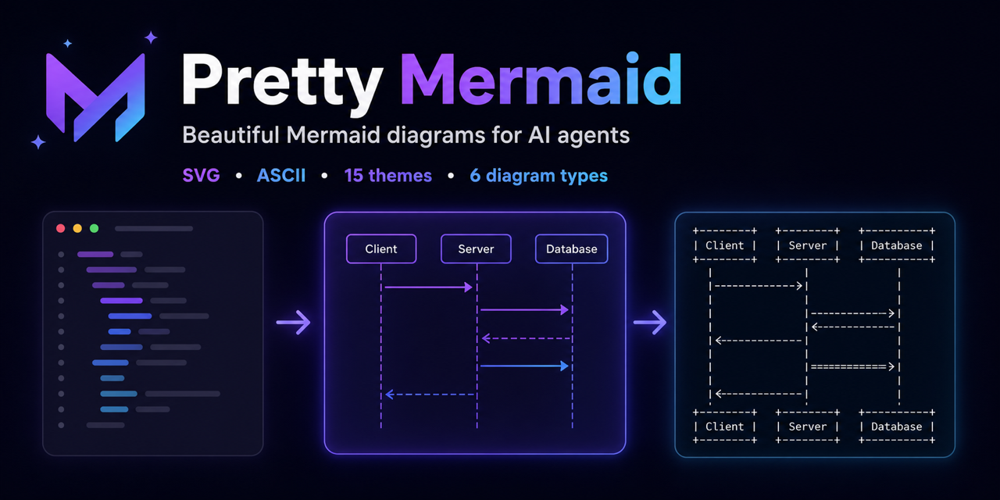

<div align="center">

# Pretty Mermaid

**为 AI Agent 打造的精美 Mermaid 图表**

将 Mermaid 源码转换为精美 SVG 与终端友好的 ASCII——本地运行，无需浏览器。



[](https://www.skills.sh/imxv/pretty-mermaid-skills/pretty-mermaid)
[](LICENSE)
[](https://nodejs.org/)
[](https://github.com/imxv/Pretty-mermaid-skills)

**中文** | [English](README.md)

</div>

## 🚀 安装

```bash
npx skills add imxv/pretty-mermaid-skills@pretty-mermaid -g -y
```

[前往 skills.sh 查看安装量与安全扫描结果 →](https://www.skills.sh/imxv/pretty-mermaid-skills/pretty-mermaid)

## 为什么选择 Pretty Mermaid？

- **专为 AI Agent 设计**：支持 Claude Code、Cursor、Codex、Gemini CLI 等环境
- **一份源码，两种输出**：文档用精美 SVG，终端用 ASCII/Unicode
- **无需浏览器**：本地渲染，不依赖 Chromium、Puppeteer 或 DOM
- **灵活开箱即用**：15 种主题、自定义配色、六种图表类型和批量渲染

## ✨ 功能特性

- 📊 **多格式支持**：支持 SVG 和 ASCII 渲染导出
- 🎨 **丰富主题**：内置 15 种精美主题，满足不同场景需求
- 📈 **六种图表类型**：支持 Flowchart、Sequence、State、Class、ER 和 XY Chart
- ⚡ **高效渲染**：支持批量并行渲染，速度飞快
- 📚 **开箱即用**：提供完整的模板和详细文档

### 支持主题列表
| Light Themes | Dark Themes | Other |
| :--- | :--- | :--- |
| zinc-light | zinc-dark | nord |
| tokyo-night-light | tokyo-night | nord-light |
| catppuccin-latte | tokyo-night-storm | dracula |
| github-light | catppuccin-mocha | one-dark |
| solarized-light | github-dark | |
| | solarized-dark | |

## 🤖 AI 助手集成

支持与以下 AI 编程环境无缝集成，通过自然语言即可调用绘图能力：

- **Claude Code**
- **Cursor**
- **Gemini CLI**
- **Antigravity**
- **OpenCode**
- **Codex**
- **qoder**

## 安装说明

### 从 GitHub 安装
```bash
npx skills add imxv/pretty-mermaid-skills@pretty-mermaid -g -y
```

### 验证安装
```bash
cd Pretty-mermaid
node scripts/themes.mjs
```
> **提示**：首次运行时会自动安装依赖，只需确保您的环境中有 Node.js。

## 📖 快速开始

### 列出可用主题
```bash
node scripts/themes.mjs
```

### 渲染单个图表
```bash
node scripts/render.mjs \
  --input diagram.mmd \
  --output output.svg \
  --theme tokyo-night
```

### 批量渲染
```bash
node scripts/batch.mjs \
  --input-dir ./diagrams \
  --output-dir ./output \
  --theme dracula
```

## 📂 使用示例

查看 `assets/example_diagrams/` 目录下的 6 个模板文件，快速上手：
- `flowchart.mmd` - 流程图
- `sequence.mmd` - 时序图
- `state.mmd` - 状态图
- `class.mmd` - 类图
- `er.mmd` - ER 图
- `xychart.mmd` - XY 图（柱状图与折线图）

渲染器同时支持中日韩状态名称、多行标签、`linkStyle`、可配置的 ELK 布局间距、XY 图交互提示，以及带 ANSI 颜色的终端输出。

## 📚 完整文档
详细使用指南请参阅 [SKILL.md](SKILL.md)

## ⚙️ 系统要求
- Node.js 14+

## 📄 许可证
MIT License

## Star History

[](https://www.star-history.com/#imxv/Pretty-mermaid-skills&type=timeline&legend=top-left)

## 🙏 致谢
基于 [beautiful-mermaid](https://github.com/lukilabs/beautiful-mermaid) 项目
