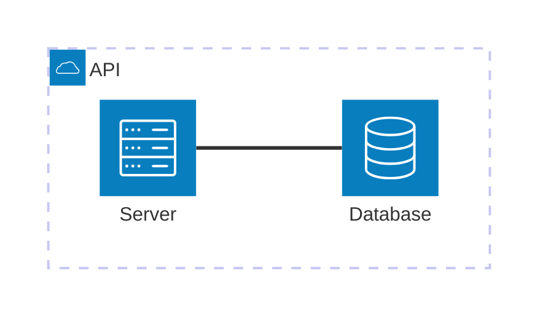
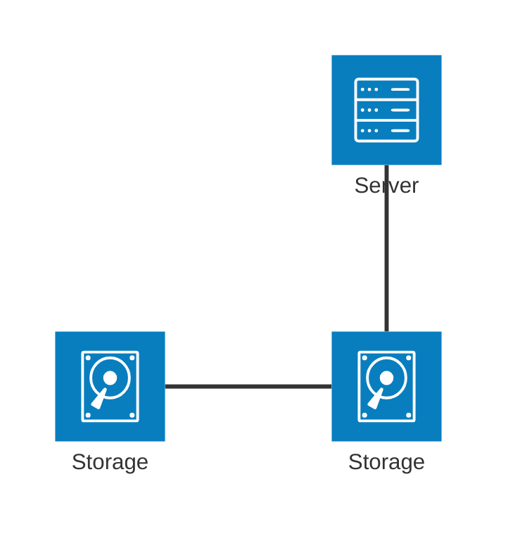
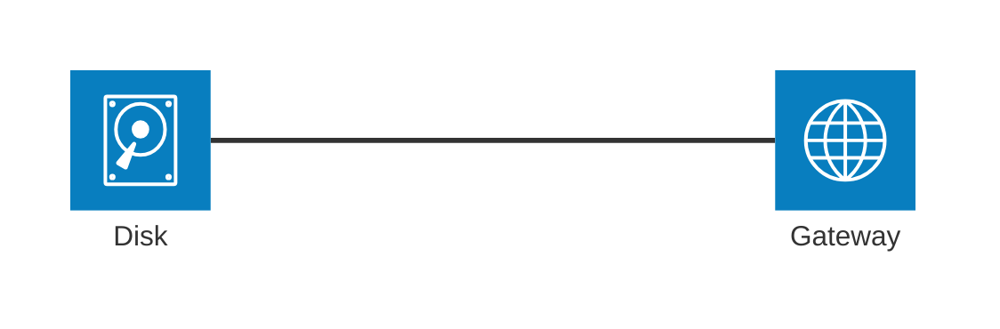

# Architecture Diagram

> **Note:** Architecture diagram is currently experimental (architecture-beta).

## Basic Syntax

## Groups and Services
- `group {id}({icon})[{title}]` - Creates a group boundary
- `service {id}({icon})[{title}] (in {group_id})?` - Creates a service node

## Connections & Direction

## Junctions (Routing)

## Best Practices
- Use meaningful icons (`cloud`, `database`, `server`, `disk`, `internet`)
- Group related services together using `in`
- Use junctions for complex multi-directional routing
