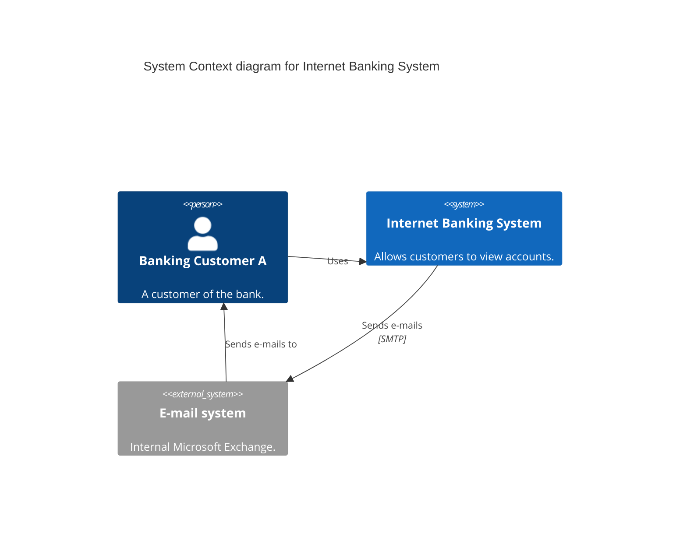
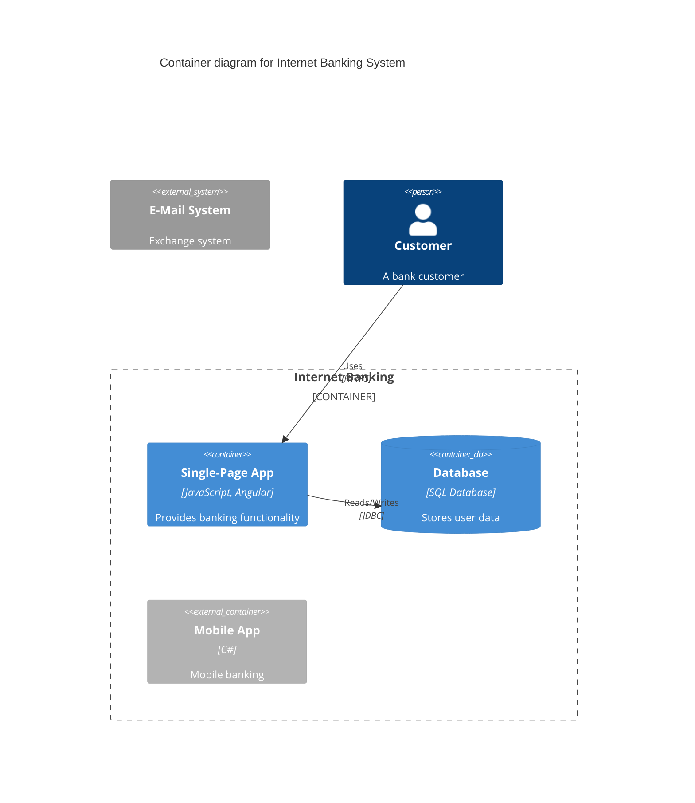

# C4 Diagram

> **Note:** C4 diagram support is designed to be compatible with PlantUML.

## Basic Context Diagram

## Boundaries & Containers

## Element Types
- `Person(alias, "Label", "Description")` / `Person_Ext`
- `System(alias, "Label", "Description")` / `System_Ext`
- `SystemDb(alias, "Label", "Description")` / `SystemDb_Ext`
- `SystemQueue(alias, "Label", "Description")` / `SystemQueue_Ext`
- `Container(alias, "Label", "Tech", "Description")` / `Container_Ext`
- `ContainerDb(alias, "Label", "Tech", "Description")`

## Boundaries
- `Enterprise_Boundary(alias, "Label") { ... }`
- `System_Boundary(alias, "Label") { ... }`
- `Container_Boundary(alias, "Label") { ... }`

## Relationships
- `Rel(from, to, "Label", "Protocol")`
- `BiRel(from, to, "Label", "Protocol")` (Bidirectional)
- `Rel_Back(from, to, "Label", "Protocol")`
