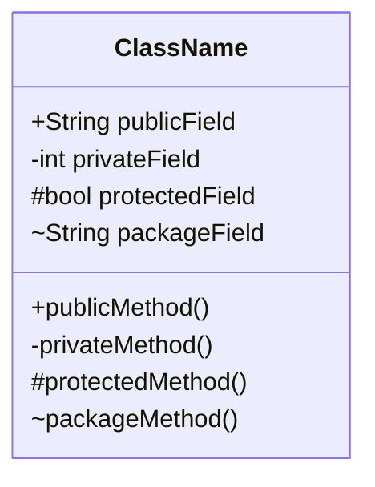
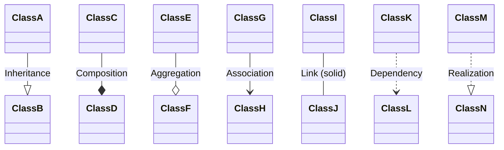
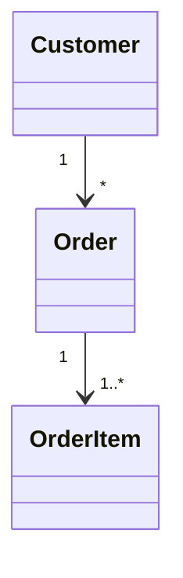
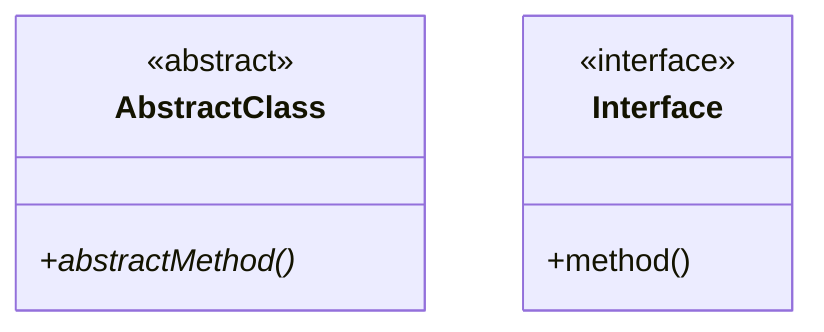

# Class Diagram

## Basic Syntax

## Visibility
- `+` Public
- `-` Private
- `#` Protected
- `~` Package/Internal

## Relationships

## Cardinality

## Abstract & Interface

## Best Practices
- Show only relevant attributes/methods
- Use inheritance sparingly
- Indicate cardinality on associations
- Group related classes visually
- Use interfaces for contracts
