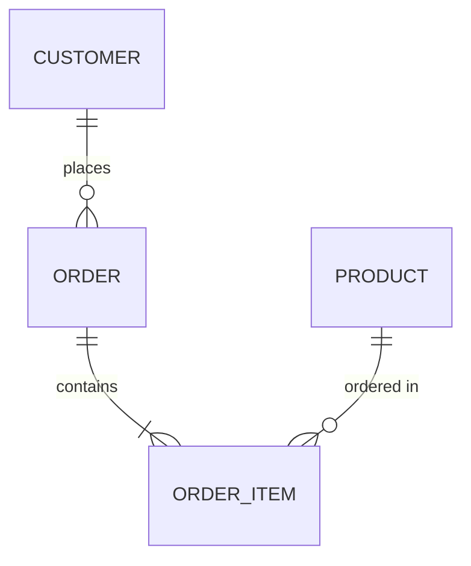
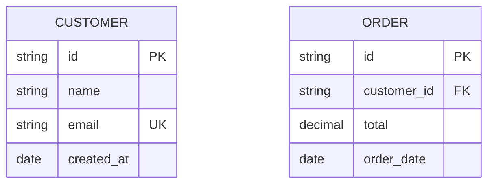

# ER Diagram

## Basic Syntax

## Cardinality
- `||--||` - One to one
- `}o--o{` - Zero or more to zero or more
- `||--o{` - One to zero or more
- `}o--||` - Zero or more to one
- `||--|{` - One to one or more
- `}|--|{` - One or more to one or more

## Attributes

## Attribute Types
- Use standard SQL types: `string`, `int`, `decimal`, `date`, `bool`
- Add constraints: `PK` (Primary Key), `FK` (Foreign Key), `UK` (Unique Key)

## Best Practices
- Use UPPERCASE for entity names
- Use snake_case for attribute names
- Always mark PK and FK
- Show only essential attributes
- Keep relationship labels clear
- Limit to 6-8 entities per diagram
