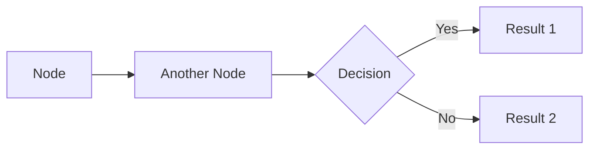

# Flowchart / Graph

## Basic Syntax

## Node Shapes
- `[Text]` - Rectangle
- `([Text])` - Stadium (rounded)
- `[[Text]]` - Subroutine (double border)
- `[(Text)]` - Cylindrical (database)
- `((Text))` - Circle
- `>Text]` - Asymmetric shape
- `{Text}` - Rhombus (decision)
- `{{Text}}` - Hexagon
- `[/Text/]` - Parallelogram
- `[\Text\]` - Trapezoid (alt)

## Connections
- `-->` - Arrow
- `---` - Line
- `-.->` - Dotted arrow
- `==>` - Thick arrow
- `--text-->` - Arrow with text
- `-->|text|` - Arrow with text (alt syntax)

## Direction
- `LR` - Left to Right
- `RL` - Right to Left
- `TB` / `TD` - Top to Bottom / Top Down
- `BT` - Bottom to Top

## Best Practices
- Use `LR` direction for wide screens
- Keep decision nodes distinct with `{}` shape
- Use stadium shapes `([])` for start/end
- Limit nesting depth to 3 levels
- Group related nodes visually
