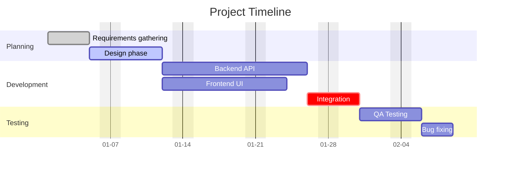

# Gantt Diagram

## Basic Syntax

## Task States
- `done` (Completed)
- `active` (In progress)
- `crit` (Critical path - highlights in red)
- *(default)* (Future task)

## Dependencies & Durations
- Explicit dates: `2024-01-01, 2024-01-05`
- Duration: `5d`, `24h`, `2w`
- After task: `after req1`
- Multiple dependencies: `after dev1 dev2`
- Until task starts: `until test1`

## Best Practices
- Always define `dateFormat YYYY-MM-DD` at the top
- Group related tasks into `section`s
- Assign unique IDs (e.g., `req1`, `dev1`) to tasks if you need to reference them later
- Use `excludes weekends` to skip non-working days in duration calculations
