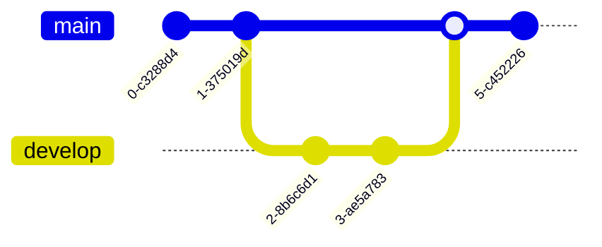
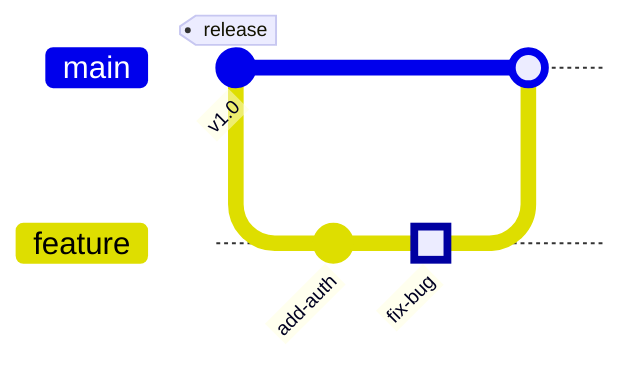
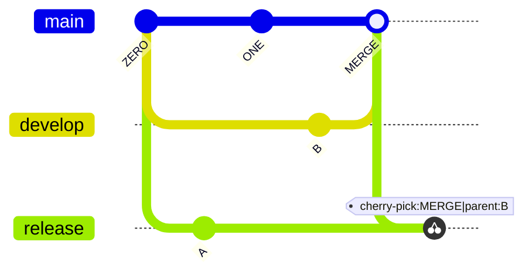

# Git Graph

## Basic Syntax

## Commits with IDs and Tags

## Commit Types
- `commit` (Normal)
- `commit type: REVERSE` (Crossed out)
- `commit type: HIGHLIGHT` (Filled)

## Cherry Picking

## Best Practices
- Keep branches logically named
- Use tags for important releases
- Use cherry-pick to show specific commit porting
- Don't overwhelm the graph with too many commits
