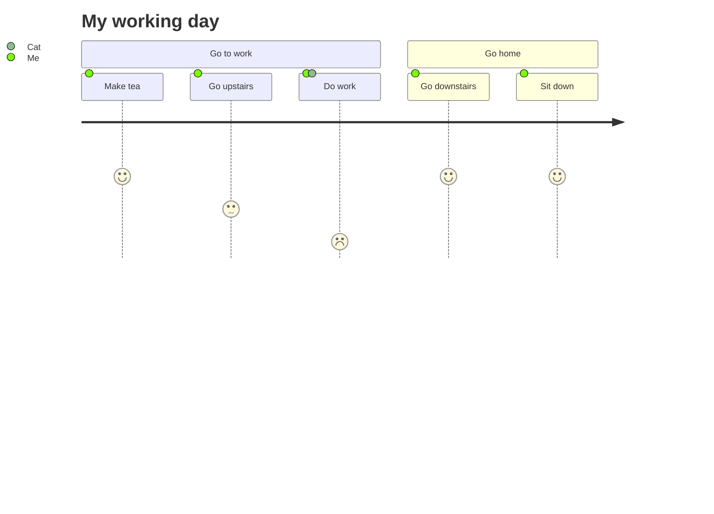
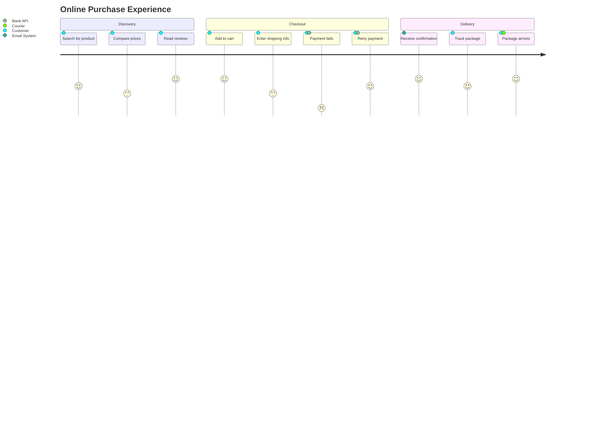

# Journey Diagram

> **Note:** Journey diagrams are designed to map a user's experience over time.

## Basic Syntax

## Structure
- `title` - The overall diagram title
- `section` - A major phase or stage of the journey
- `task: score: actor1, actor2` - A specific step in the journey
  - **task** - Description of the action
  - **score** - A numerical value (1-5, or more) representing satisfaction/duration/effort
  - **actor(s)** - Comma-separated list of participants

## Example: Online Shopping

## Best Practices
- Use a consistent scoring scale (e.g., 1-5 where 5 is high satisfaction)
- Identify all actors involved in each step
- Group related tasks into logical sections
