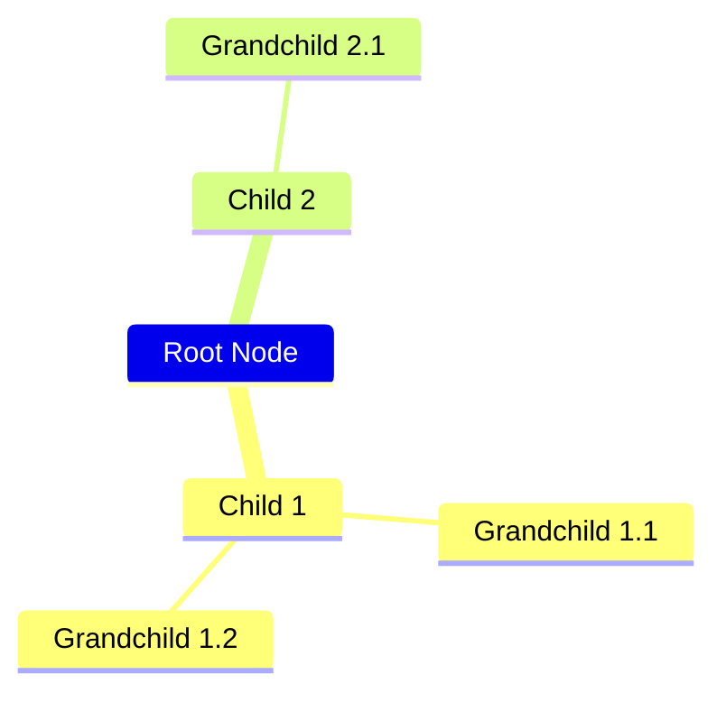
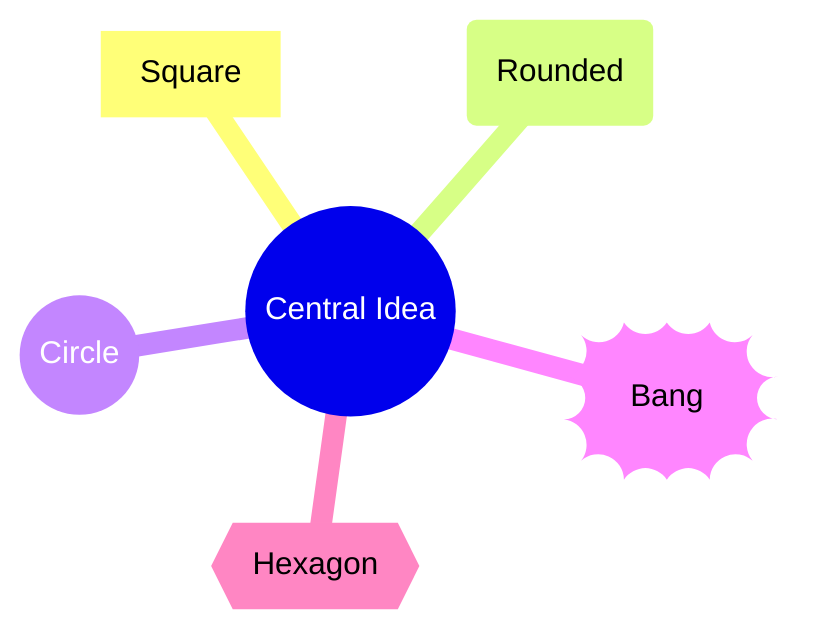
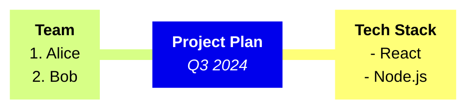

# Mindmap

> **Note:** Mindmaps rely entirely on indentation to establish hierarchy.

## Basic Syntax


## Node Shapes
Shapes are defined by the brackets used around the text (similar to Flowcharts).



## Markdown Formatting & Multi-line
You can use standard markdown inside nodes by wrapping the text in <code>"\`markdown\`"</code>.



## Best Practices
- Ensure consistent indentation (spaces or tabs, but don't mix them within the same mindmap)
- Keep node text concise
- Use markdown blocks ```"`...`"``` for lists or multi-line text instead of making the mindmap too deep
