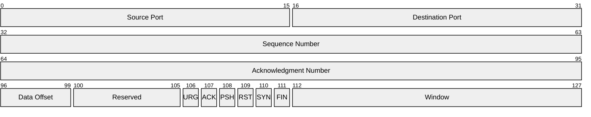
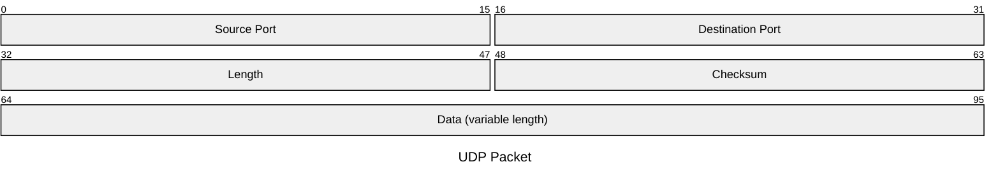
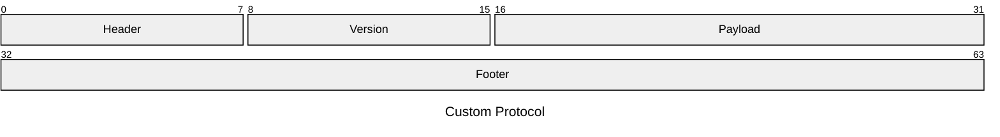

# Packet Diagram

## Basic Syntax (Absolute Bit Ranges)

## Simplified Syntax (Relative Bit Counts)

## Mixed Syntax

## Best Practices
- Use standard byte boundaries (8, 16, 32 bits) where possible
- Use relative bit counts (`+16`) for simpler authoring
- Single bits can be specified individually (e.g., `106: "URG"`)
- Include a title for clarity
