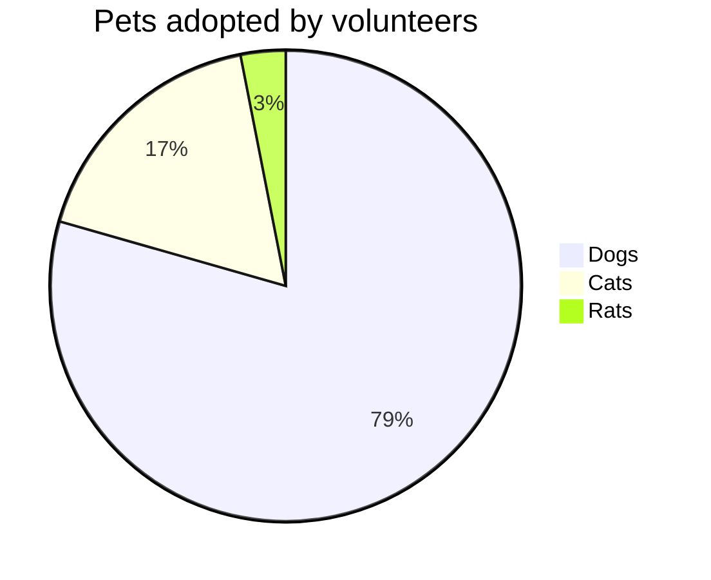
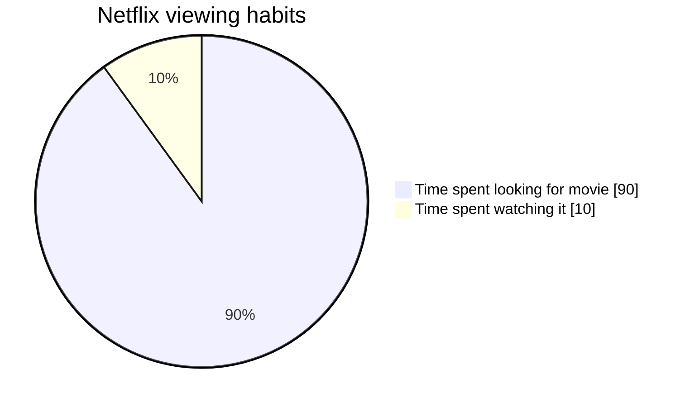
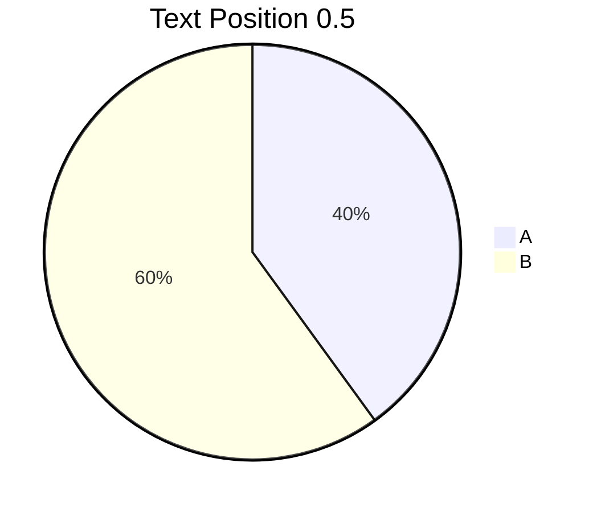

# Pie Chart

## Basic Syntax

## Options
- `title` - Optional title for the pie chart
- `showData` - (Optional) Add this keyword after `pie` to render the actual data values next to the legend text.

## Configuration
You can customize the text position relative to the pie slices.

*(0.0 is center, 1.0 is edge)*

## Best Practices
- Data must be positive numeric values (supported up to two decimal places)
- Labels must be enclosed in quotes (`""`)
- Slices are rendered clockwise in the order they are defined
