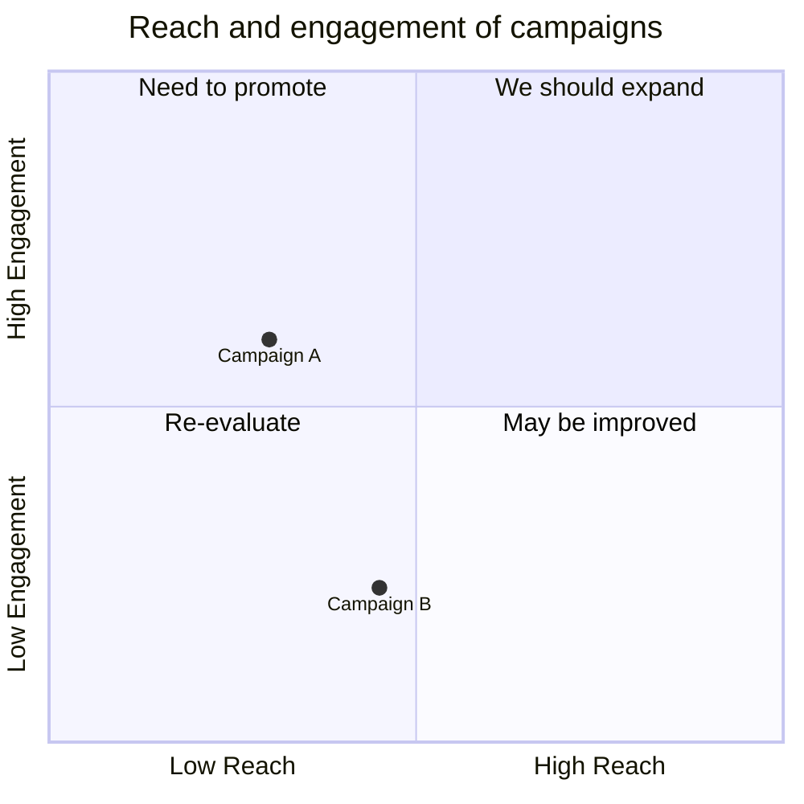
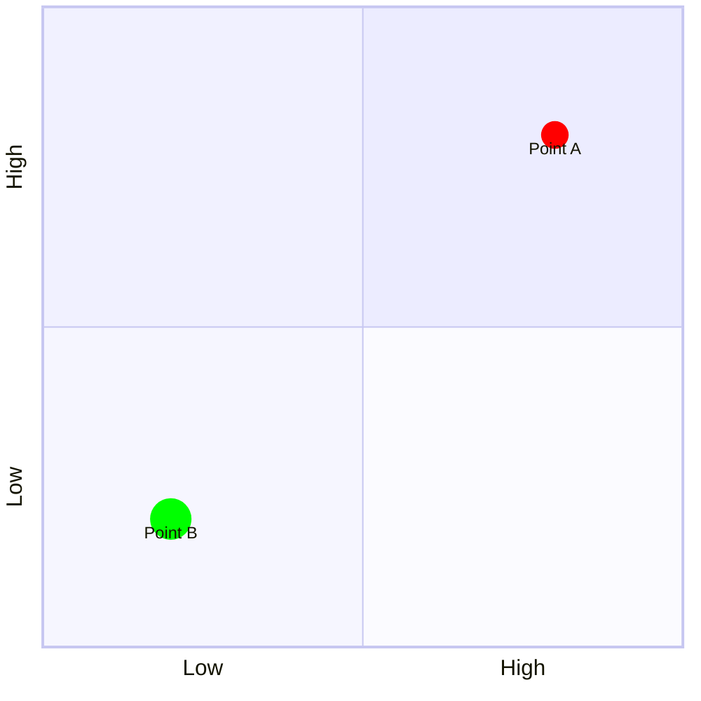

# Quadrant Chart

## Basic Syntax

## Structure
- `title` - (Optional) Title of the chart
- `x-axis` / `y-axis` - Labels for the axes. Use `-->` to define left/right or bottom/top labels
- `quadrant-1` to `quadrant-4` - Labels for the four quadrants (1 is top-right, 2 is top-left, 3 is bottom-left, 4 is bottom-right)
- `Point Name: [x, y]` - Data points where x and y are values between 0.0 and 1.0

## Styling Points
You can apply inline styling to individual points or use classes.

## Best Practices
- Keep quadrant text short (2-3 words)
- X and Y values *must* be between 0.0 and 1.0 (representing percentage along the axis)
- Use standard styling classes if you have many points to keep the code clean
