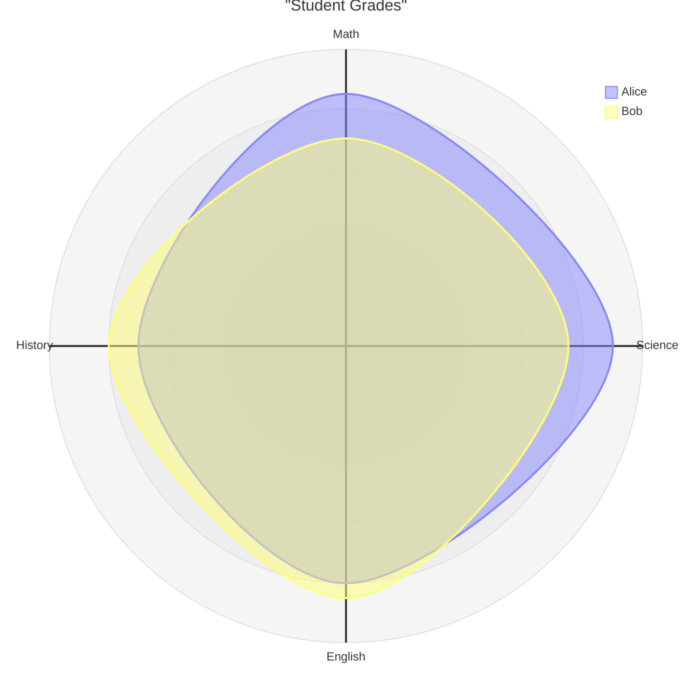
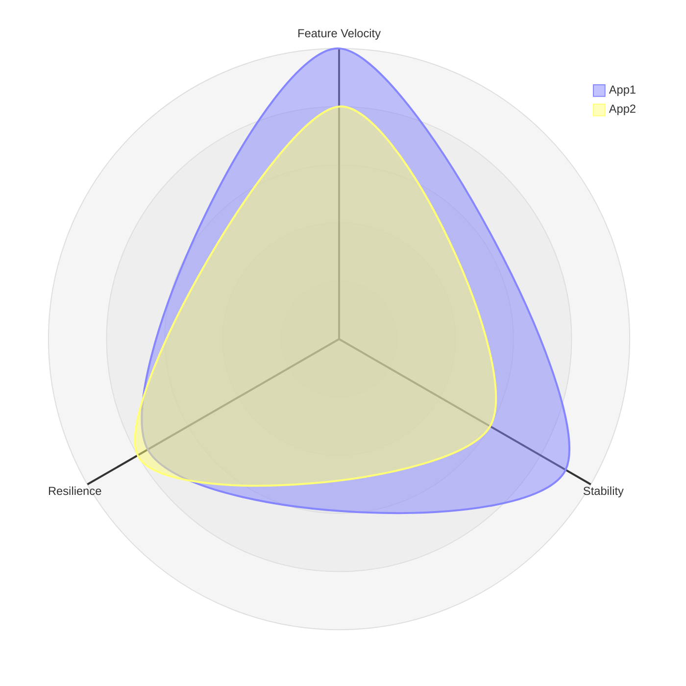

# Radar Chart

> **Note:** Radar diagrams are an experimental feature (`radar-beta`).

## Basic Syntax

## Structure
- `axis` - Defines the axes radiating from the center. You can define multiple axes on one line or split them across lines.
  - E.g., `axis id["Display Name"]`
- `curve` - Defines a data series (the filled polygon on the chart).
  - E.g., `curve id["Legend Name"]{val1, val2, ...}`
- `max` / `min` - Sets the scale bounds for all axes
- `showLegend` - `true` or `false` to toggle the legend
- `ticks` - Number of concentric grid lines (e.g., `ticks 5`)
- `graticule` - `polygon` or `circle` (default is `polygon`)

## Alternative Data Syntax
You can explicitly map values to specific axes instead of relying on the order.

## Best Practices
- Explicitly map values to axes if the number of axes is large to avoid order mistakes
- Set explicit `min` and `max` values to ensure the scale is consistent and accurate
- Keep the number of curves small (2-4) to avoid the chart becoming unreadable
