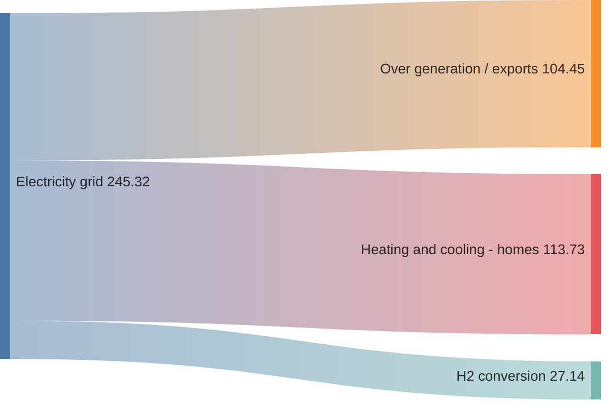
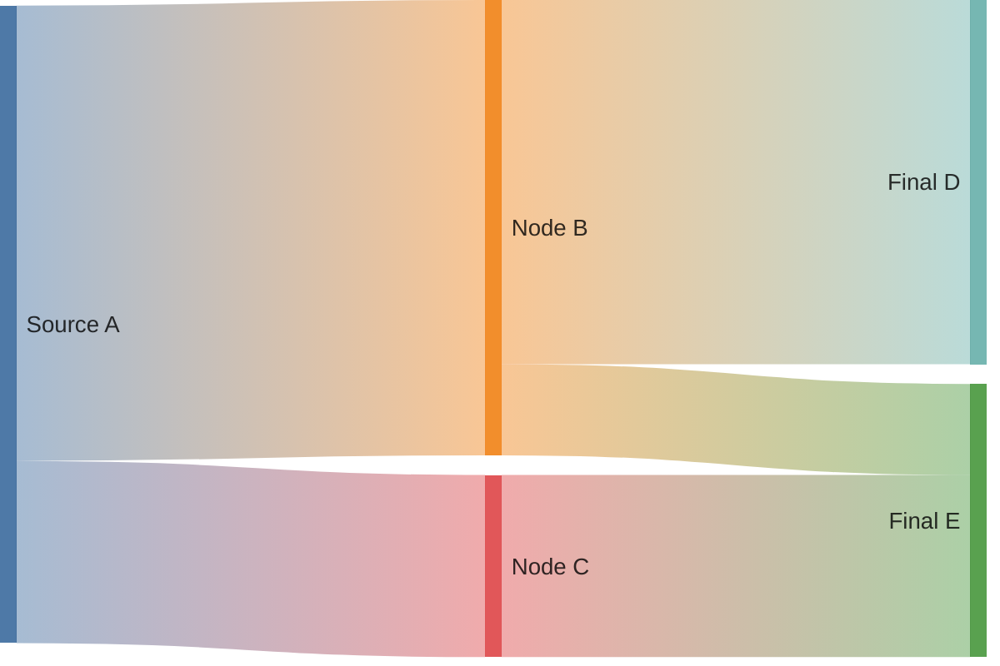

# Sankey Diagram

> **Note:** Sankey diagrams represent flows from one set of values to another. This is an experimental feature in Mermaid.

## Basic Syntax
The syntax is based on raw CSV data with exactly 3 columns: `source,target,value`.

## Advanced Configuration
You can configure the Sankey diagram using frontmatter to change visuals, hide values, or use gradient links.

## Best Practices
- Data must be exactly three columns separated by commas
- Do not use spaces around commas unless they are part of the node name
- Use quotes `""` or `''` if node names contain commas
- Use `linkColor: gradient` in config for a more modern, blended look
