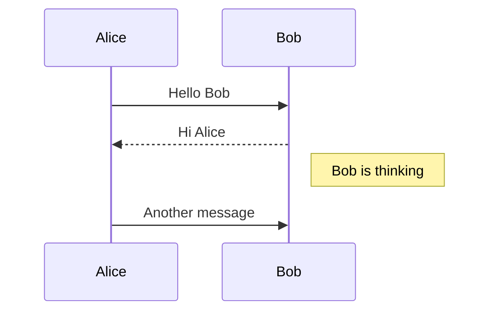
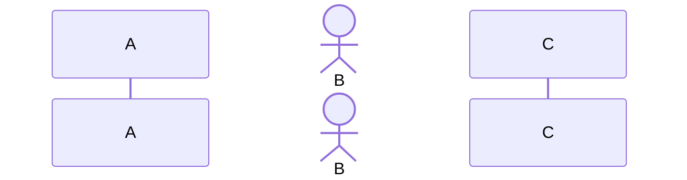
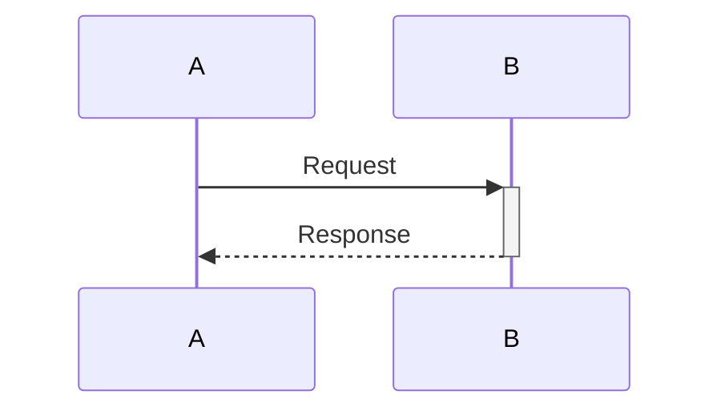
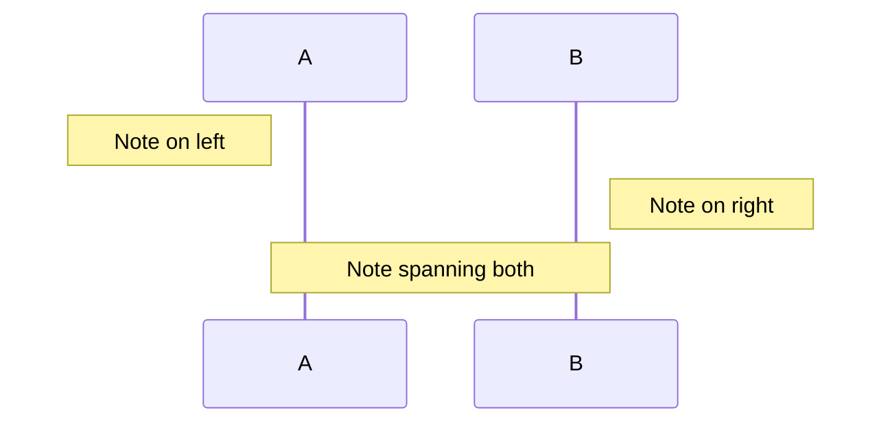
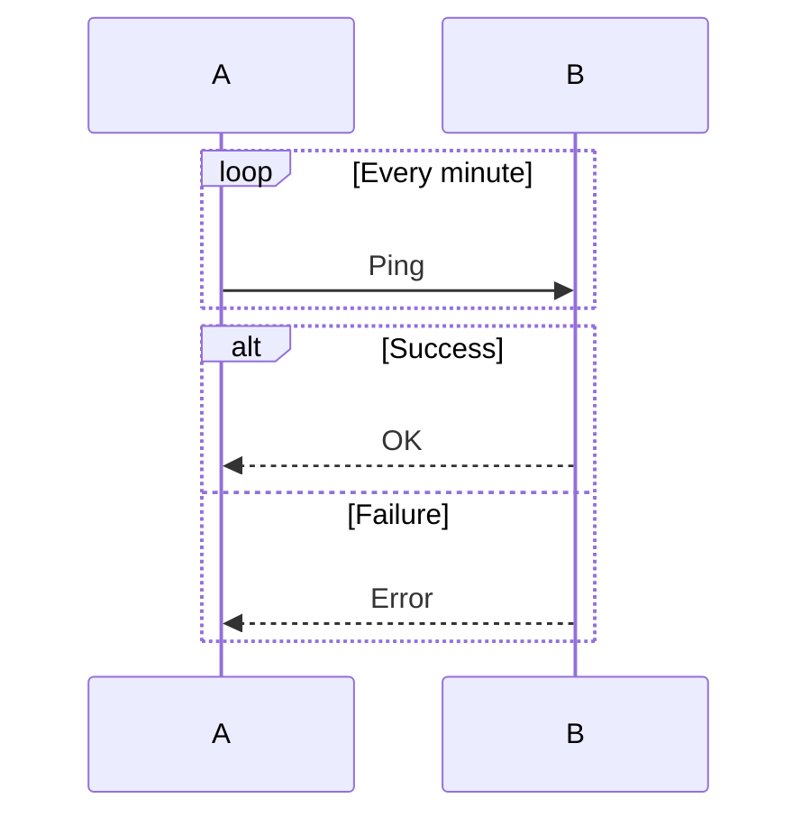

# Sequence Diagram

## Basic Syntax

## Participants

## Message Types
- `->>` - Solid line arrow
- `-->>` - Dotted line arrow
- `-x` - Solid line with cross
- `--x` - Dotted line with cross
- `-)` - Solid line with open arrow
- `--)` - Dotted line with open arrow

## Activations

## Notes

## Loops & Alt

## Best Practices
- Use meaningful participant names
- Add notes for complex logic
- Keep sequence linear (avoid too many branches)
- Use activations to show processing time
- Limit to 5-7 participants for clarity
