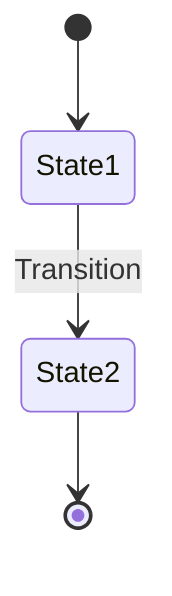
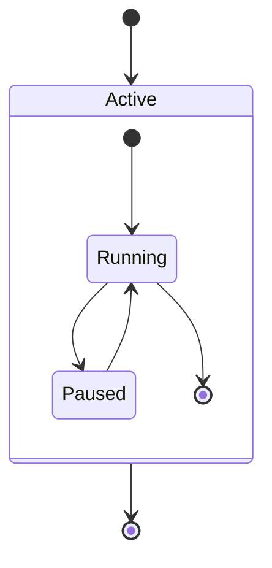
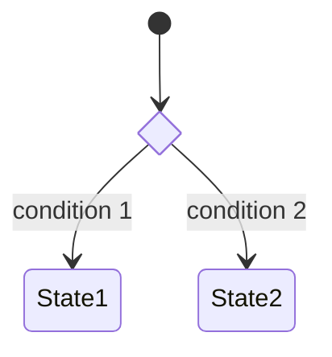
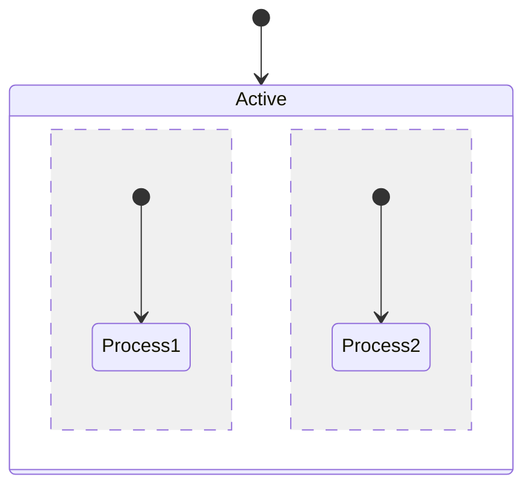
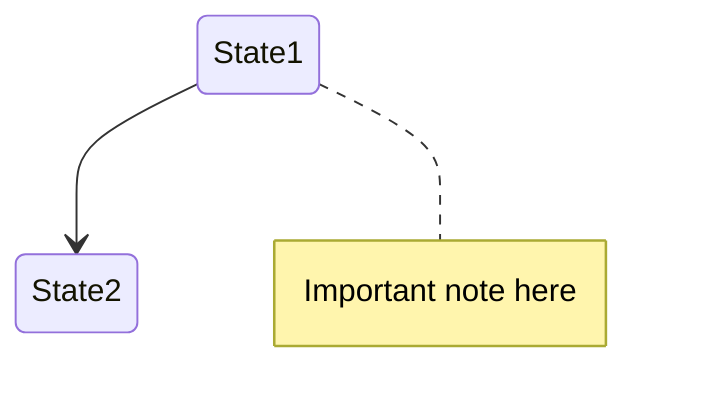

# State Diagram

## Basic Syntax

## Composite States

## Choice

## Concurrency

## Notes

## Best Practices
- Start with `[*]` for initial state
- Use clear transition labels
- Limit composite state depth to 2 levels
- Group related states together
- Use choice nodes for complex branching
