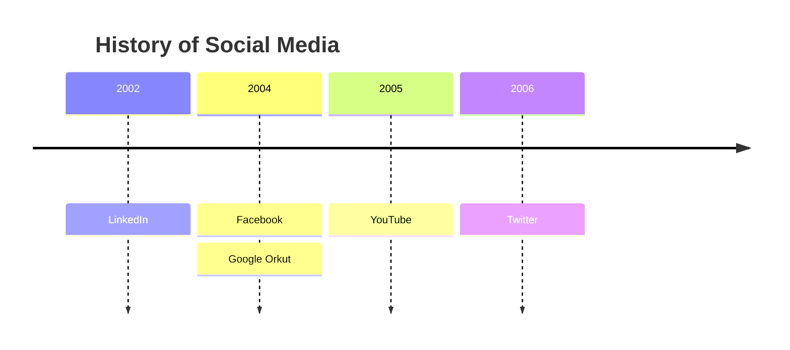
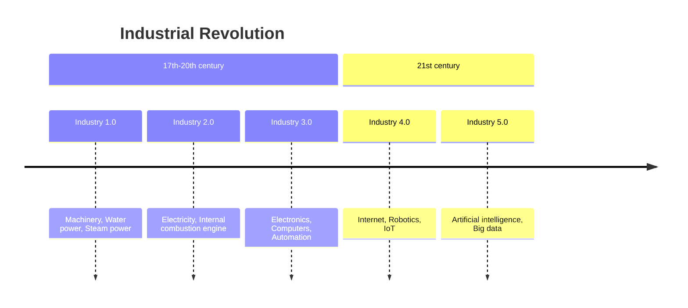
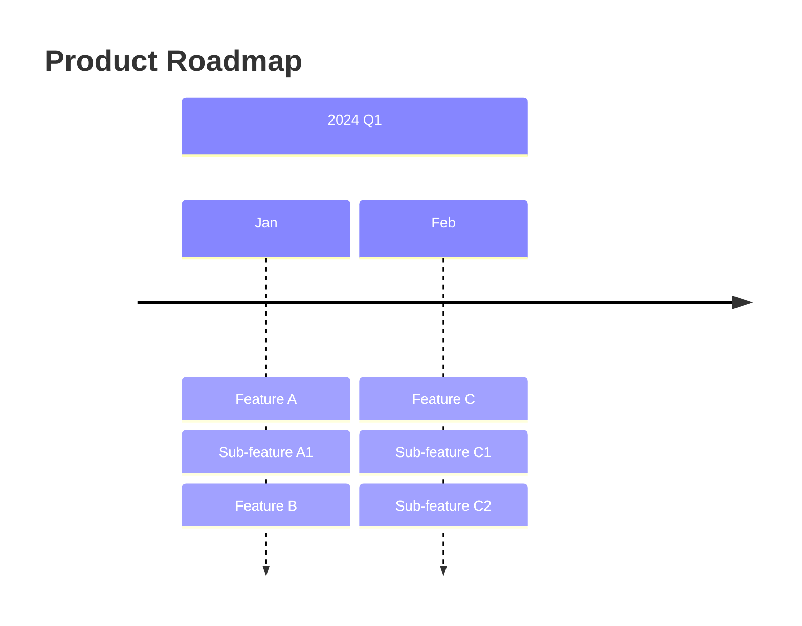

# Timeline

## Basic Syntax

## Grouping by Sections
Use the `section` keyword to group time periods and apply consistent styling.

## Multi-level Events
You can chain colons to create sub-points under a single time period. Use ` ` for explicit line breaks within text.

## Best Practices
- Keep event descriptions short and punchy
- Group logical eras into `section`s
- If an event has multiple bullet points, chain them with colons rather than creating new lines
