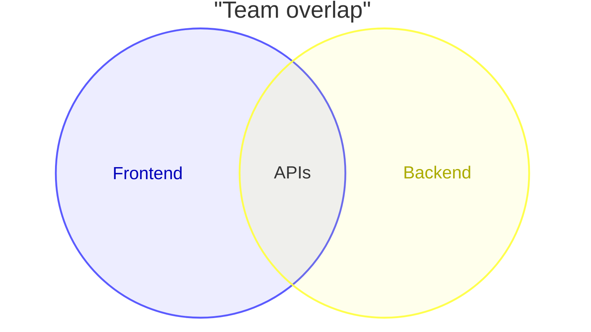
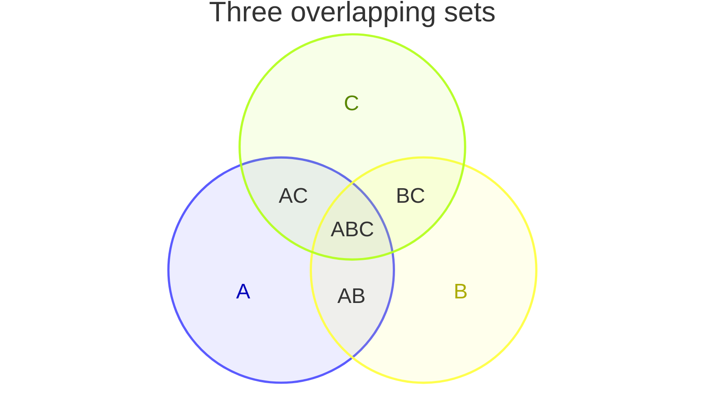

# Venn Diagram

> **Note:** Venn diagrams show relationships between sets using overlapping circles. This is a new diagram type (`venn-beta`).

## Basic Syntax

## Creating Sets and Unions
- `venn-beta` - Starts the diagram definition
- `title` - Optional title
- `set A["Display Name"]` - Defines a set. You can use a short identifier (`A`) and a quoted string for the display label (`"Display Name"`).
- `union A,B["Label"]` - Defines the overlap between set `A` and set `B`.

## Example: Three Overlapping Sets

## Best Practices
- Identifiers in `union` statements must be defined by earlier `set` lines.
- Use bracket syntax `["..."]` to assign human-readable display labels to sets and unions while keeping the internal identifiers short.
- Keep to 2 or 3 sets for clarity; Venn diagrams become overly complex and difficult to read with 4 or more sets.
