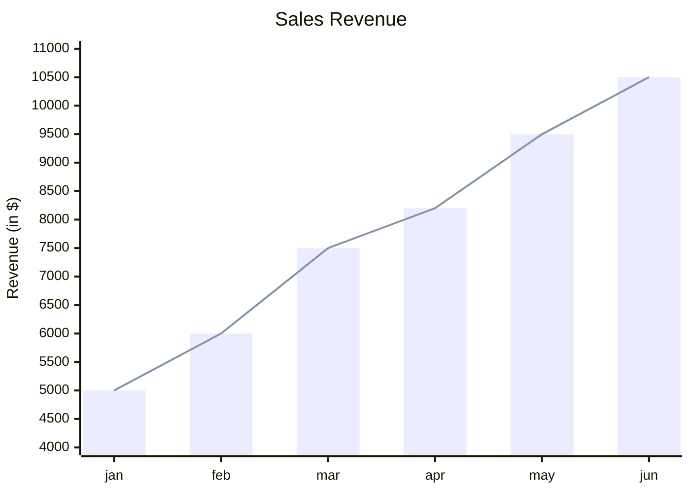
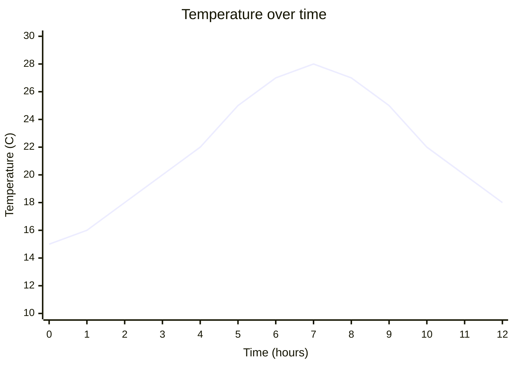

# XY Chart

> **Note:** XY charts support bar and line series plotted on shared categorical or numerical axes.

## Basic Syntax

## Structure
- `xychart` - Starts the chart definition
- `title` - Optional chart title in quotes
- `x-axis` - Defines the X-axis (can be an array of categories `[a, b, c]` or a numeric range `min --> max`)
- `y-axis` - Defines the Y-axis (must be a numeric range `min --> max`)
- `bar` - Data points for a vertical bar series
- `line` - Data points for a line series

## Example: Numeric X-Axis

## Best Practices
- The length of data arrays (`bar` and `line`) must match the length of the `x-axis` categories or the implicit points on a numeric axis
- You can combine multiple `bar` and `line` series in the same chart
- Use clear labels with units (e.g., `"Revenue (in $)"`)
