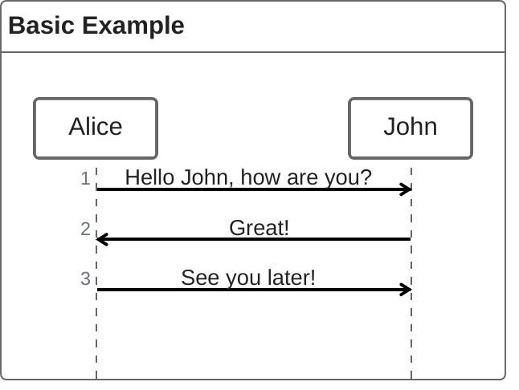
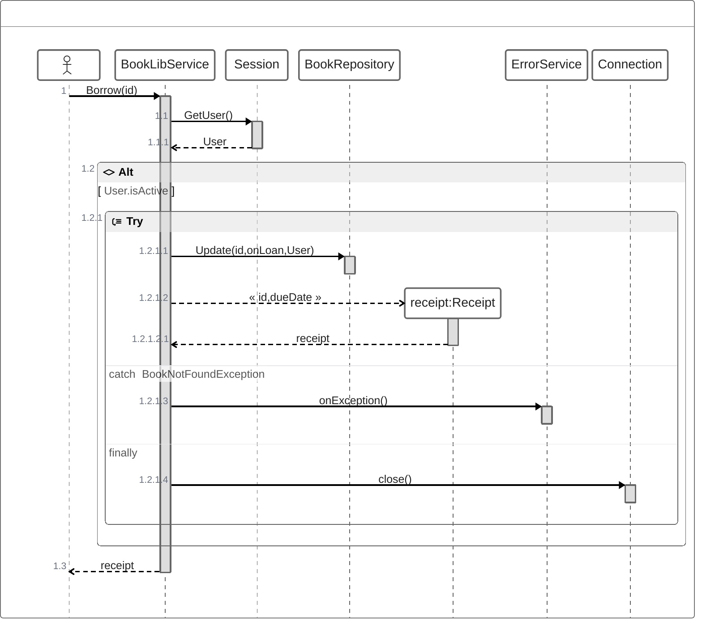
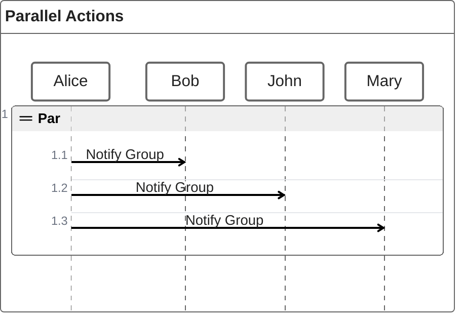

# ZenUML

> **Note:** ZenUML is an alternative syntax for Sequence diagrams that focuses on a more programming-like structure.

## Basic Syntax

## Method Calls & Logic
ZenUML shines when modeling code-like behavior, including conditions, try/catch, and returns.

## Parallel Actions
Use the `par` block for concurrent actions.

## Best Practices
- Use ZenUML instead of standard `sequenceDiagram` when the interaction closely mirrors actual source code
- Take advantage of `{}` blocks to show execution context
- Participants are created implicitly based on their first appearance
